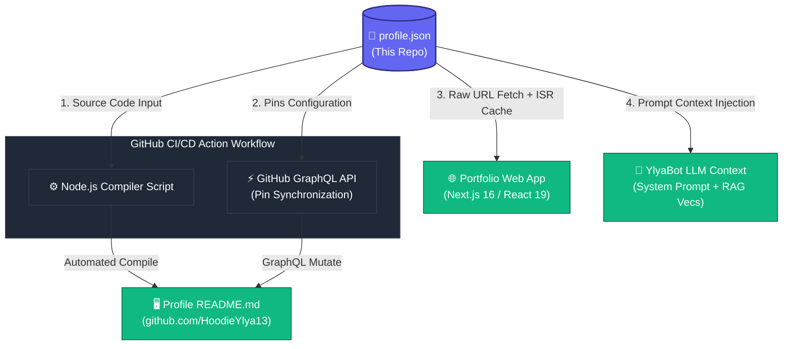

# Portfolio — HoodieYlya13

## Centralized Engineering Profile & SSoT (Single Source of Truth)

<div align="center">
  

  <h3>🚀 Senior Full-Stack Developer • Next.js & React Expert • GenAI / RAG Engineer</h3>
  
  <p>
    <strong>Welcome to my automated GitHub presence!</strong> This repository serves as the absolute <strong>Single Source of Truth (SSoT)</strong> for my professional identity, experience history, technical competencies, and my active projects.
  </p>

  <p align="center">
    <a href="https://www.hy13dev.com"></a>
    <a href="https://www.linkedin.com/in/ylya-martchenko"></a>
    <a href="mailto:ylyamartchenko@proton.me"></a>
  </p>
</div>

---

## 🤖 Meet YlyaBot — My Virtual AI Concierge

Don't have time to parse through my whole resume? My AI agent, **YlyaBot**, is fully operational and embedded on my [Live Portfolio](https://www.hy13dev.com/ylya-bot).

YlyaBot is a **RAG-powered LLM** specifically tuned to represent my technical philosophy, experience, and background.

- **Dynamic System Context:** Directly injected with `profile.json` as its primary grounding matrix.
- **Exhaustive Repository Context:** Supplemented with `portfolio.json` files generated across all my public and private repositories—functioning as a comprehensive vector-based repository index.
- **Deterministic Fact-Grounding:** Ensures YlyaBot speaks with absolute precision regarding my engineering decisions, stack preferences, and past achievements, avoiding hallucinations.

👉 **[Launch YlyaBot & ask about my experience ↗](https://www.hy13dev.com/ylya-bot)**

---

## 🏗️ System Architecture & Data Flow

This repository is more than a profile; it is the **control plane** for my entire web presence. By decoupling data from presentation, a single change to [`profile.json`](./profile.json) updates my GitHub profile page, feeds my Next.js portfolio website, and hot-swaps the core knowledge base of **YlyaBot**.



### 1. The Single Source of Truth: `profile.json`

All details—my contact info, skills matrix, engineering and academic timelines, placement preferences, and repository pins—live within a unified [`profile.json`](./profile.json).

- **Zero Duplication:** No manual copy-pasting between my resume, LinkedIn, GitHub profile, and portfolio.
- **Machine Readable:** Fully structured schema allows automated compilation and ingestion.

### 2. The Compiler Pipeline (Node.js & GitHub Actions)

A Node.js script executed by a automated GitHub Actions workflow processes the `profile.json` on push to:

- **Assemble the Markdown Layout:** Seamlessly compile the profile data into a beautiful, dynamic, and structured `README.md`.
- **Sync Repository Pins:** Use the GitHub GraphQL API to dynamically synchronize the featured repositories pinned to my GitHub overview page based on the `pinned_repositories` array inside `profile.json`.

### 3. Next.js 16 & React 19 Portfolio Integration

My personal portfolio, built on **Next.js 16** and **React 19**, references this repository directly:

- **Server-Side Fetching:** The Next.js data layer queries the raw `profile.json` from this repository on the fly using a high-efficiency async Server Component fetch.
- **Next.js Caching & Revalidation:** Leverages granular, time-based incremental static regeneration (`revalidate: 3600`) or standard React 19 `'use cache'` directives to ensure ultra-low TTFB while updating automatically when `profile.json` changes.
- **PPR (Partial Prerendering):** The shell of my portfolio is served statically in milliseconds, while slow-loading dynamic database or API calls (like live repository statuses) are streamed using React `Suspense` placeholders.

### 4. RAG-Based LLM Pipeline (YlyaBot)

For my personal AI, **YlyaBot**:

- **Prompt Grounding:** `profile.json` is fetched raw and loaded directly into YlyaBot's system prompt context on session initiation, giving the AI agent a robust foundation of my verified credentials.
- **Vector RAG Corpus:** Every repository under my account includes a dedicated `portfolio.json` containing detailed architectural logs, codebase overviews, design decisions, and technology selections. These are scraped, chunked, and embedded into a vector database to provide high-fidelity RAG capabilities when users query YlyaBot about my engineering choices.

---

## 🛠️ Technical Stack (The Portfolio & Agent Ecosystem)

Here are the modern frameworks, programming languages, and platforms powering this ecosystem:

| Component          | Technologies & Frameworks                                      | Key Architecture Principles                                           |
| :----------------- | :------------------------------------------------------------- | :-------------------------------------------------------------------- |
| **Frontend Web**   | Next.js 16 (App Router), React 19, TypeScript, Tailwind CSS v4 | Server Component Composition, Inverse of Control, Glassmorphism UI    |
| **Interactive UX** | WebGL (Three.js), GSAP, React Bits elements                    | Smooth micro-animations, liquid glass visuals, zero-drag rendering    |
| **Data Engine**    | GitHub GraphQL API, raw JSON streams, next-cache               | Cache-on-the-Edge, SSoT Architecture, Incremental Static Regeneration |
| **Agent / AI**     | Next.js Server Actions, Vercel AI SDK, Vector Embeddings (RAG) | Prompt Grounding, Context Injection, Stateless API routes             |
| **CI / CD**        | GitHub Actions, Node.js scripts, Custom Shell Hooks            | Automated Compile-on-Push, Programmatic repository pin sync           |

---

## ⚡ Next.js 16 & React 19 Technical Deep Dive

The portfolio site leveraging this data structure has been architected to follow cutting-edge industry standards:

### 🔄 Asynchronous Data Access Layer

In Next.js 16, system-level contexts and request properties (like cookies, headers, and route parameters) are now fully asynchronous. The data access layer strictly awaits these parameters:

```typescript
// Example: Next.js 16 Async Request API & Cache Revalidation
export async function getGithubData() {
  const remoteUrl =
    "https://raw.githubusercontent.com/HoodieYlya13/HoodieYlya13/main/profile.json";

  // High-performance Fetch with 1-hour ISR cache
  const res = await fetch(remoteUrl, {
    next: { revalidate: 3600 },
  });

  if (!res.ok) throw new Error("Failed to load profile");
  return await res.json();
}
```

### ⚡ Partial Prerendering (PPR)

PPR combines the best of static site generation (SSG) and dynamic server-side rendering (SSR). The main layout shell is built statically during deployment and served immediately. Dynamic chunks, such as my active repositories timeline or the YlyaBot interface, are interleaved using React 19 `<Suspense>` blocks:

```tsx
// Example of Server/Client interleaving for optimal performance
import { Suspense } from "react";
import TimelineContainer from "@/components/timeline/TimelineContainer";
import TimelineCard from "@/components/timeline/TimelineCard";

export default async function ExperiencePage() {
  return (
    <div className="portfolio-shell">
      {/* Static Header - served instantly */}
      <Header title="My Experience" />

      {/* Dynamic Content - streamed progressively */}
      <Suspense fallback={<TimelineSkeleton />}>
        <ExperienceTimelineContent />
      </Suspense>
    </div>
  );
}
```

---

## 🧬 Repository Pin Synchronization Script

Here is a look at the core pipeline script that updates my profile layout and modifies pinned repositories on my profile page programmatically:

```javascript
// scripts/sync-profile.js
const fs = require("fs");
const { GraphQLClient, gql } = require("graphql-request");

async function syncPins(pinnedNames) {
  const endpoint = "https://api.github.com/graphql";
  const graphQLClient = new GraphQLClient(endpoint, {
    headers: {
      authorization: `Bearer ${process.env.GITHUB_TOKEN}`,
    },
  });

  console.log(
    `🔄 Synchronizing pinned repositories: ${pinnedNames.join(", ")}`,
  );

  // Dynamic GraphQL mutation to re-pin repositories programmatically
  // based on the contents defined in profile.json
  const mutation = gql`
    mutation changeUserPins($itemIds: [ID!]!) {
      profilePinItems(
        input: { clientMutationId: "sync-profile", itemIds: $itemIds }
      ) {
        pinnedItems {
          nodes {
            ... on Repository {
              name
            }
          }
        }
      }
    }
  `;

  // Implementation queries repository node IDs and triggers mutation
  // ...
}
```

---

## 🤝 Let's Connect!

I am always looking for challenging engineering opportunities, specifically involving high-performance frontends, complex cloud architectures, or GenAI integrations.

- 💼 **Placement Preferences:** Hybrid/Remote roles within **Luxembourg**, **Switzerland**, or **North America**.
- 🎯 **Technical Domains:** Web Development, AI/RAG, Space Engineering, IoT, Cloud & DevOps, and Embedded Systems.
- 📬 **Direct Inquiries:** [ylyamartchenko@proton.me](mailto:ylyamartchenko@proton.me)

---

<div align="center">
  <sub>Generated automatically with ❤️ by the <a href="https://github.com/HoodieYlya13/HoodieYlya13/actions">Node.js CI/CD Pipeline</a>. Centralized data schema: version 1.4.2</sub>
</div>
